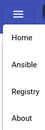
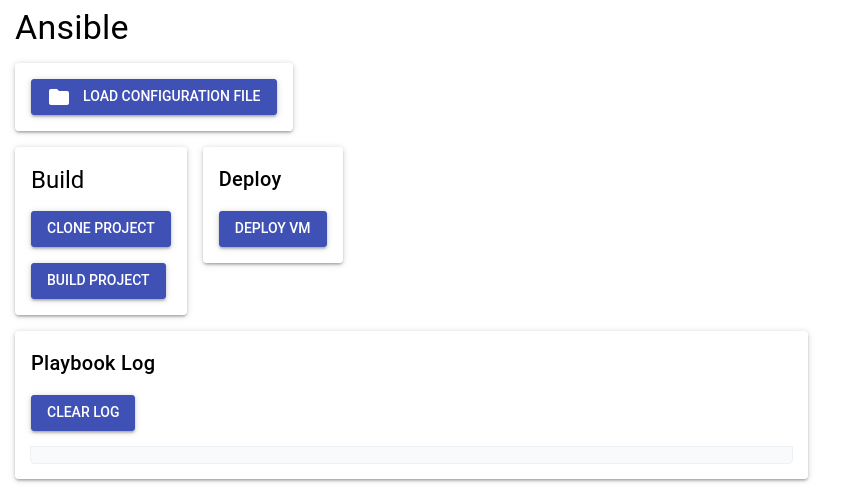

# Usage with GUI

We have simple UI available at <https://forge.ublue.local>.

## Navigation

For navigation you can use the navigation bar on the top left.

### Home

Currently nothing to see here. The goal is to display some
general information here. Link to documentation and important
news etc.

### Ansible

Here you can load your forge configuration file from the data store,
clone a project and build the container image. The buttons should be self explanatory.
The "Deploy VM" button is currently a mock-up, sorry :wink:
we are [working](https://github.com/ublue-os/forge/issues/35) on it.

### Registry

Currently nothing to see here. The goal is to display some
information about the docker registry <registry.ublue.local> here.
Like a list of all available images you have uploaded etc.

### About

Currently nothing to see here. The goal is to display some
information here about the software and versions used in this project
and maybe some acknowledgments etc.
