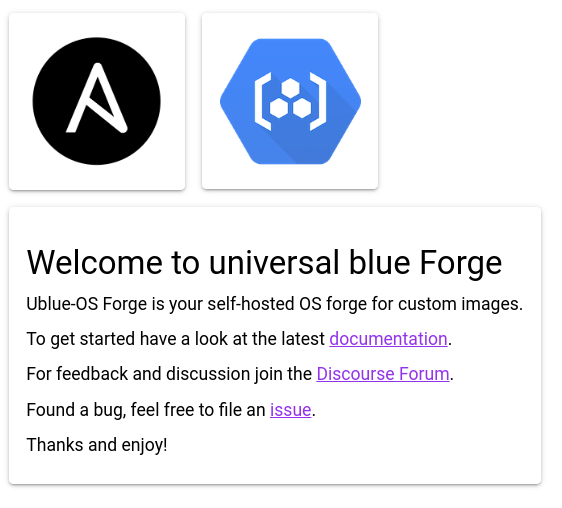
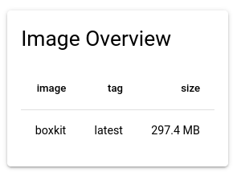
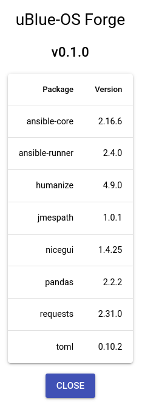

# Usage with GUI

We have simple UI available at <https://forge.ublue.local>. This page should give
you a glimpse on what to expect before you try out the project.

## Navigation

For navigation you can use the navigation menu on the top left.

### Home

Start page with links and information.

### Ansible

Here you can load your forge [configuration](./index.md#configuration) file from the data store,
clone projects and build container images. The buttons should be self explanatory.
The "Deploy VM" button is currently a mock-up, sorry :wink:
we are [working](https://github.com/ublue-os/forge/issues/35) on it.

### Registry

Here you get an overview of all images available in
the container registry `registry.ublue.local`.

### About

If you are interested about software versions used etc. you can go to the about page.

